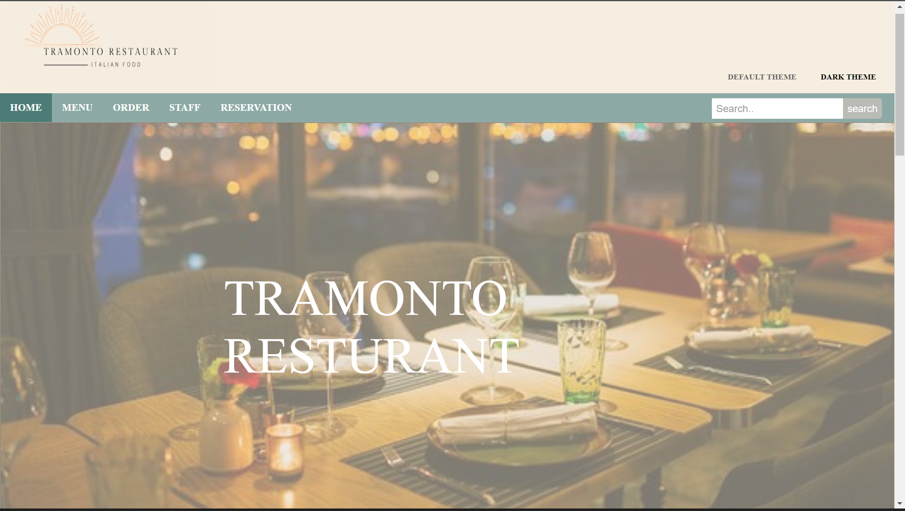
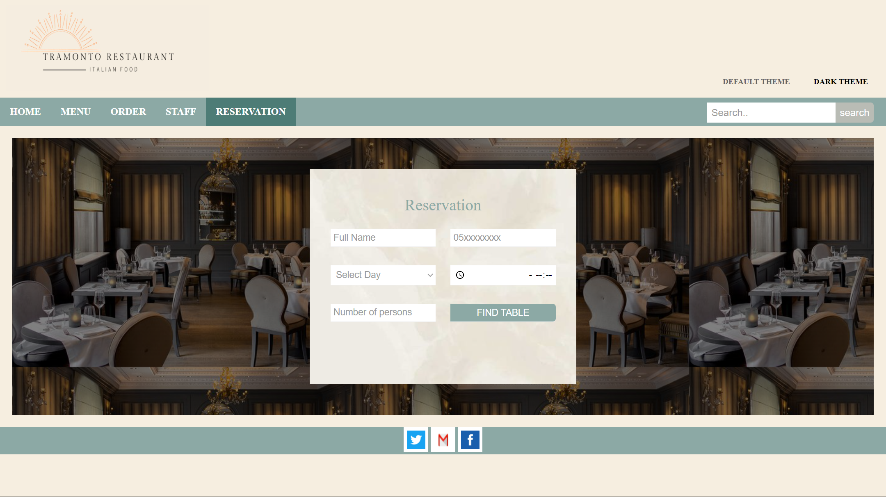
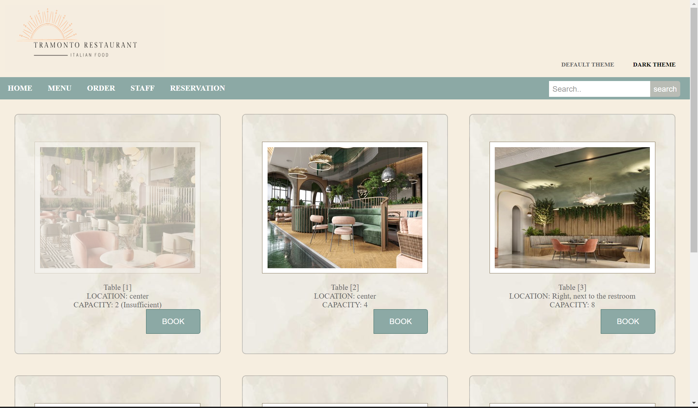
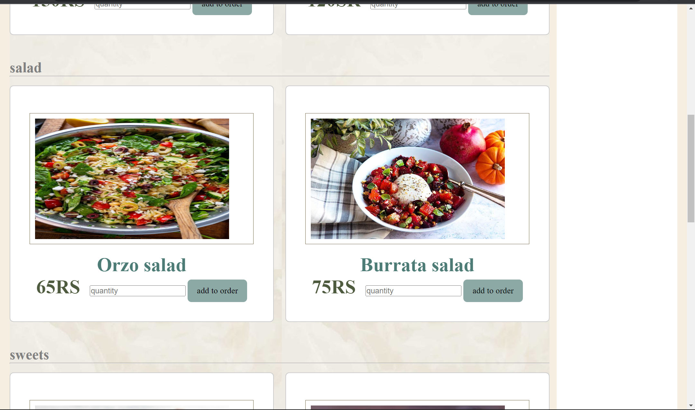
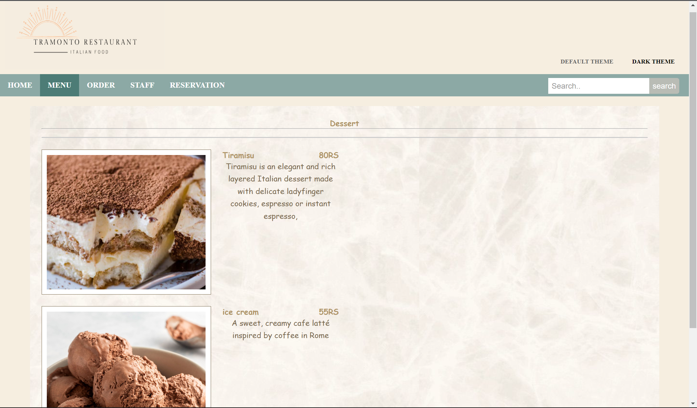
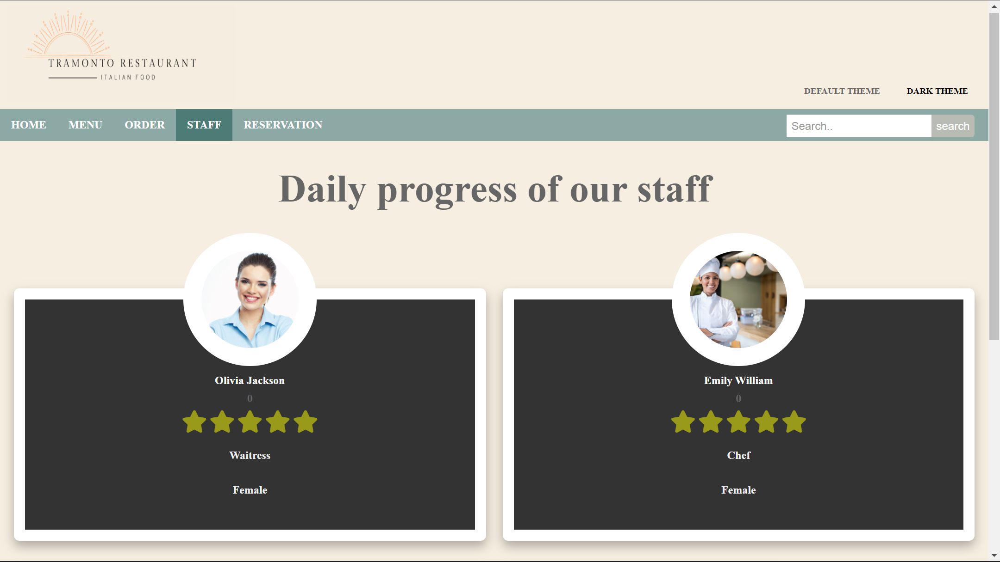

<h1 align="center">Tramento </h3>

  
  <a href="https://github.com/fahda2001/tramonto">
    
  </a>

# Introduction:
  
Many restaurant owners struggle with managing the restaurant/bookings/menu, as well as 
dealing with customers. Because a customer who had an easy and efficient experience is more 
likely to return. Owners frequently seek out for a great and simple website that can meet their 
needs. Our website's main goal is to assist restaurant owners in managing their interactions 
with clients, effectively presenting their products, and assisting with reservations

# programming language: 

 
<a href="https://github.com/fahda2001/tramonto">
    
    
    
    
    
    
    
    
    
    
    
  </a>

